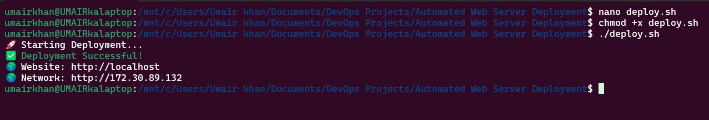
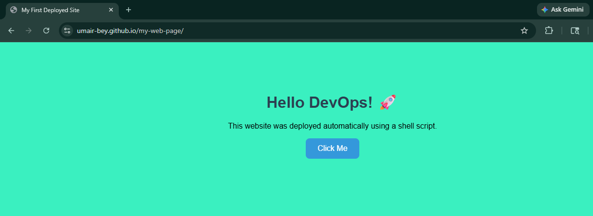
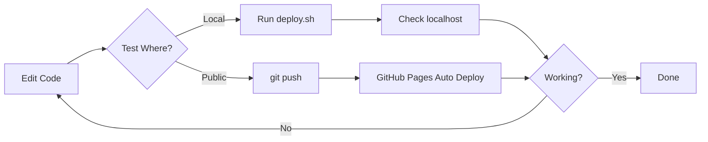

# 🚀 Automated Web Server Deployment

A beginner DevOps project demonstrating website deployment using **Apache Web Server on Ubuntu Linux** and **GitHub Pages**.

The project includes a simple static website built with HTML, CSS, and JavaScript, along with a Bash script to automate local deployment.

---

# 🌍 Live Demo

**Website:**  
https://umair-bey.github.io/my-web-page/

**GitHub Repository:**  
https://github.com/Umair-bey/my-web-page

---

# 📸 Project Preview

## Website


## Deployment Script



## GitHub Pages



---

# 🔄 Development Workflow

This project uses two deployment environments:

- **Local Deployment** using Apache on Ubuntu
- **Public Deployment** using GitHub Pages



## Workflow Explanation

1. Edit website files (`index.html`, `style.css`, `script.js`)
2. Test locally by running:

```bash
./deploy.sh
```

3. Open:

```text
http://localhost
```

4. If everything works:

```bash
git add .
git commit -m "Update website"
git push
```

5. GitHub Pages automatically updates the public website.
6. Verify changes on the live site.

# 📌 Project Overview

This project was created to learn:

- HTML, CSS, and JavaScript
- Linux command line basics
- Bash scripting
- Apache Web Server
- Git and GitHub
- GitHub Pages hosting
- Website deployment workflow

The website can be accessed:

- Locally through Apache (`http://localhost`)
- Publicly through GitHub Pages

---

# ✨ Features

- Responsive webpage
- Interactive JavaScript button
- Automated deployment script
- Apache-based local hosting
- GitHub Pages public hosting
- Version controlled with Git

---

# 🛠️ Technologies Used

| Technology | Purpose |
|------------|----------|
| HTML5 | Webpage structure |
| CSS3 | Styling |
| JavaScript | Interactivity |
| Bash | Deployment automation |
| Apache2 | Local web server |
| Ubuntu Linux | Deployment environment |
| Git | Version control |
| GitHub | Repository hosting |
| GitHub Pages | Public website hosting |

---

# 📂 Project Structure

```text
my-web-page/
│
├── deploy.sh
├── index.html
├── style.css
├── script.js
├── README.md
│
└── screenshots/
    ├── website.png
    ├── deploy-script.png
    └── github-pages.png
```

---

# 🚀 Running the Project Locally

## Install Apache

```bash
sudo apt update
sudo apt install apache2 -y
```

## Clone Repository

```bash
git clone https://github.com/Umair-bey/my-web-page.git
cd my-web-page
```

## Run Deployment Script

```bash
chmod +x deploy.sh
sudo ./deploy.sh
```

## Open Website

```text
http://localhost
```

---

# 🤖 Deployment Script

The `deploy.sh` script automates:

- Installing Apache
- Copying website files
- Setting permissions
- Restarting Apache

Example:

```bash
./deploy.sh
```

Output:

```text
🚀 Starting Deployment...
✅ Deployment Successful!
```

---

# 🔄 Git Workflow Used

```bash
git add .
git commit -m "Updated website"
git push
```

---

# 📚 What I Learned

Through this project I learned:

- Linux terminal usage
- Bash scripting fundamentals
- Apache server management
- File permissions in Linux
- Git and GitHub workflow
- GitHub Pages deployment
- Project documentation

---

# 🎯 Future Improvements

- Docker containerization
- CI/CD using GitHub Actions
- Nginx deployment
- Custom domain setup
- Visitor analytics
- HTTPS configuration

---

# 👨‍💻 Author

**Umair Khan**

GitHub: https://github.com/Umair-bey

---

# 🏆 Learning Outcome

This project helped me understand the complete workflow:

```text
HTML / CSS / JavaScript
            ↓
          Git
            ↓
        GitHub
            ↓
    GitHub Pages

and

HTML / CSS / JavaScript
            ↓
         Linux
            ↓
        Apache
            ↓
      Local Website
```

This was my first hands-on deployment project using Linux, Apache, Git, and GitHub.
